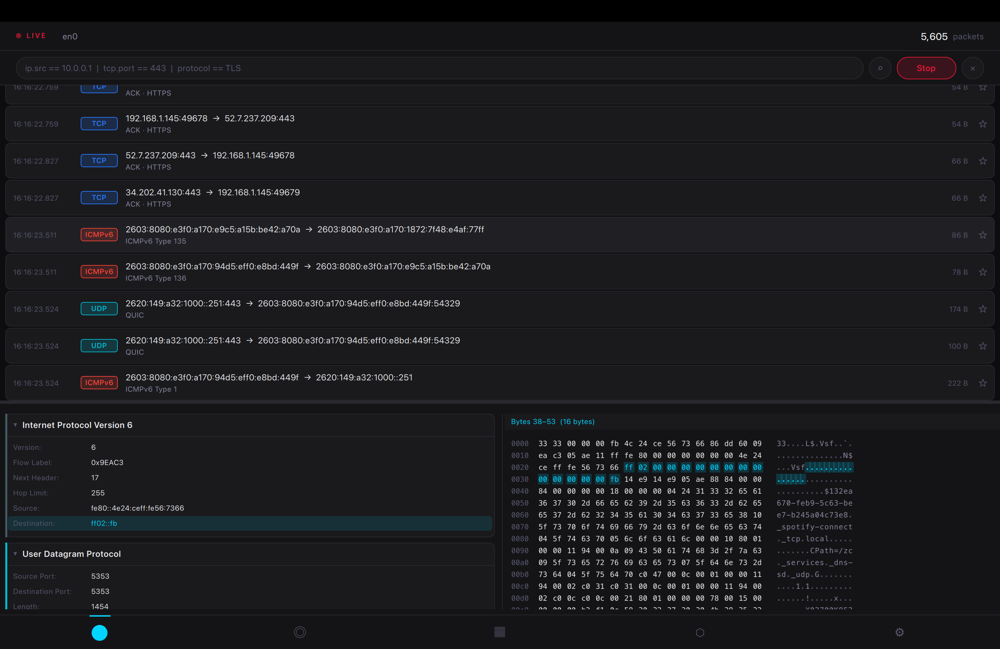
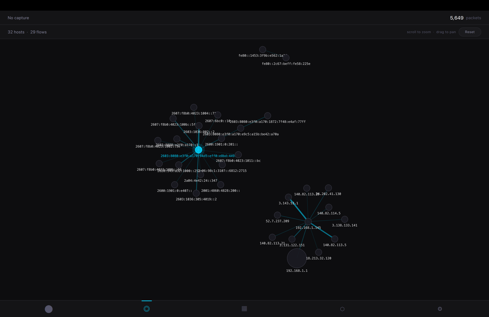

# OpenShark

> A fast, minimal network packet analyzer for macOS — built with Qt6, QML, and libpcap.






---

## Features

**Live Capture**
- Capture on any network interface with BPF
- Real-time packet list with protocol-aware info column
- Display filters (`ip.src == x`, `protocol == TLS`, substring match)
- Packet search, bookmarks, and Follow Stream (TCP reassembly)

**Protocol Dissection**
- Ethernet · IPv4 · IPv6 · TCP · UDP · ICMP · ICMPv6 · ARP · DNS · HTTP · TLS
- Collapsible layer tree with per-field hex highlighting
- Hex/ASCII viewer synced to selected field

**Network Map**
- Force-directed topology graph updated in real time
- Zoom, pan, drag nodes — click a node to filter the packet list to that host

**Stats**
- Throughput chart (bytes/sec, last 60 s)
- Protocol breakdown donut
- Top talkers by bytes transferred

**File I/O**
- Open and save `.pcap` / `.pcapng` files
- Drag-and-drop import

---

## Requirements

| Dependency | Version | Install |
|---|---|---|
| macOS | 14.0+ | — |
| Qt | 6.5+ | `brew install qt` |
| libpcap | system | included with macOS |
| CMake | 3.21+ | `brew install cmake` |

---

## Build

```bash
cmake -B build -DCMAKE_PREFIX_PATH=$(brew --prefix qt)
cmake --build build
```

The app bundle is at `build/openshark.app`.

---

## Run

```bash
sudo ./build/openshark.app/Contents/MacOS/openshark
```

`sudo` is required for BPF raw packet access. To capture without it, add your user to the `access_bpf` group:

```bash
sudo dseditgroup -o edit -a $(whoami) -t user access_bpf
```

---

## Stack

- **C++20** — capture engine, ring buffer, packet dissector, all data models
- **Qt6 / QML** — GPU-accelerated UI, Canvas 2D charts, force-directed graph
- **libpcap** — packet capture and PCAP file I/O
